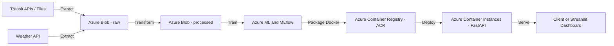

# TransitX - Transit Delay Prediction (Azure End-to-End)

**Goal:** Predict bus/train delays using historical transit, weather, and event signals.

**Scope:** Data engineering (Azure Blob), ML (sklearn/XGBoost), MLOps (MLflow, DVC), Deployment (Docker + Azure).


-----

## Tech Stack
- **Data Engineering:** Python, Azure Blob Storage 
- **ML / MLOps:** scikit-learn, XGBoost, MLflow, DVC, Azure ML 
- **API / Deployment:** FastAPI, Docker, Azure Container Registry (ACR), Azure Container Instances (ACI)
- **CI/CD:** GitHub Actions

-----


## Repository Layout
<pre>
transitx-project/
├─ data/ # (gitignored) local data cache
├─ notebooks/ # EDA, experiments
├─ src/
│ ├─ pipelines/ # extract.py, transform.py, load.py
│ ├─ models/ # train.py, predict.py
│ └─ utils/ # helpers (azure blob, logging)
├─ models/ # (gitignored) saved models
├─ deployment/ # FastAPI app, Dockerfile
├─ docs/ # diagrams, images
└─ .github/workflows/ # CI/CD

</pre>

-----

## Architecture Overview



-----


## Local Setup

```bash
#create virtual environment
python3 -m venv .venv
source .venv/bin/activate

#install dependencies
pip install -r requirements.txt

#copy or edit environment variables
cp .env.example .env # ( if you have an example file)
#or manually fill .env with your Azure Details
```

-----


## ETL Workflow

| Phase | Script | Description |
|-------|---------|-------------|
| **Extract** | `src/pipelines/extract.py` | Downloads multi-year TTC transit delay data and weather data, then uploads to Azure Blob (`raw`). |
| **Transform** | `src/pipelines/transform.py` | Cleans and merges datasets (2023–2024) and uploads to the `processed` container. |
| **EDA** | `notebooks/01_eda.ipynb` | Basic analysis of delay trends and route-wise summaries. |
| **Model** | `src/models/train.py` | Trains an ML model (XGBoost / scikit-learn) and tracks runs in MLflow. |
| **Deploy** | `deployment/app.py` | FastAPI inference API containerized with Docker and deployed on Azure Container Instances. |


-----


## Azure Storage Layout

containers/
├─ raw/
│ ├─ ttc_bus_delay_2023.csv
│ ├─ ttc_bus_delay_2024.csv
│ ├─ weather_2023.csv
│ └─ weather_2024.csv
└─ processed/
├─ ttc_combined_processed.csv
└─ ttc_delay_summary.csv


-----

## Sample Run

```bash
# Run ETL end-to-end
python src/pipelines/extract.py
python src/pipelines/transform.py
```

Expected Output:

```bash
[2025-11-07 20:27:55] Starting extraction......
Found dataset for 2023 : https://ckan0.cf.opendata.inter.prod-toronto.ca/.../ttc-bus-delay-data-2023.xlsx
Dowloading .../ttc-bus-delay-data-2023.xlsx
Saved to data/raw/ttc_bus_delay_2023.xlsx
Converting XLSX -> CSV for 2023
Uploaded ttc_bus_delay_2023.csv -> container 'raw'
Completed processing for 2023
Dowloading .../weather_2023.csv
Uploaded weather_2023.csv -> container 'raw'
2023 Data extracted successfully
Found dataset for 2024 : https://ckan0.cf.opendata.inter.prod-toronto.ca/.../ttc-bus-delay-data-2024.xlsx
Dowloading .../ttc-bus-delay-data-2024.xlsx
Saved to data/raw/ttc_bus_delay_2024.xlsx
Converting XLSX -> CSV for 2024
Uploaded ttc_bus_delay_2024.csv -> container 'raw'
Completed processing for 2024
Dowloading .../weather_2024.csv
Uploaded weather_2024.csv -> container 'raw'
2024 Data extracted successfully
Extraction Complete.


Starting transformation ...
Read ttc_bus_delay_2023.csv → 56,000 rows
Read ttc_bus_delay_2024.csv → 58,000 rows
Uploaded cleaned dataset: ttc_combined_processed.csv
Transformation complete.
```

-----

### **Data Sources & Credits

**Transit Data:**  
[TTC Bus Delay Data](https://open.toronto.ca/dataset/ttc-bus-delay-data/) — City of Toronto Open Data Portal  
License: [Open Government Licence – Toronto](https://open.toronto.ca/open-data-license/)

**Weather Data:**  
[Open-Meteo Historical Weather API](https://open-meteo.com/) — Hourly weather data for Toronto, Canada

---

**Author:**  
**Jaya Karthik Nidumolu**  
*MEng, Electrical and Computer Engineering (AI/ML Specialization), University of Waterloo — Class of 2025*  

*Developed post-graduation to expand my skills in Azure-based data engineering, MLOps, and end-to-end machine learning pipelines.*


