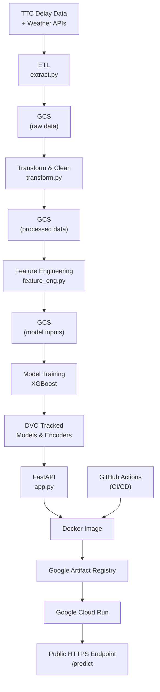

# TransitX — Cloud-Native, Real-Time, Production-Ready Transit Delay Prediction (Analytics · Machine Learning · Data Engineering · CI/CD)
**TransitX** is a full end-to-end MLOps system that predicts TTC bus delay duration and delay likelihood using:
- Multi-year TTC delay data
- Weather history & weather forecasts
- Route & stop metadata
- Inference-time feature engineering

The project demonstrates modern **data engineering, cloud deployment, CI/CD automation, and real-time ML inference** following industry-grade standards.

---

## Live Demo

### Interactive Streamlit Dashboard
[Live Streamlit Dashboard](https://transitx-project-jknidumolu.streamlit.app)

### Live Real-Time API (Google Cloud Run)
```bash
POST https://transitx-api-874451770694.us-central1.run.app/predict
```

---

## Project Highlights
- End-to-end ETL → Feature Engineering → XGBoost Model Training → Deployment
- Real-time inference API served through **FastAPI + Docker + Google Cloud Run**
- Interactive analytics dashboard built using **Streamlit**
- Full orchestration through an **Airflow DAG**
- Dataset and model versioning managed by **DVC**
- Automated image build and deployment using **GitHub Actions → GCP Cloud Run**
- Cloud migration history: **Azure → Railway → Google Cloud Run**

---

## Project Goal
The goal of TransitX is to build a robust and production-ready ML system that:
- Extracts TTC delay + weather datasets
- Generates ML-ready features
- Trains XGBoost classifier & regression models
- Supports batch inference and real-time inference
- Provides stable public cloud deployment
- Ensures full reproducibility through DVC & CI/CD
- Demonstrates a real-world MLOps architecture

---

## Tech Stack
### Data Engineering
- Python
- Azure Blob Storage (initial staging)
- Google Cloud Storage (current storage)
- Apache Airflow

### ML / MLOps
- XGBoost, scikit-learn
- DVC
- MLflow (local experiment tracking)

### Deployment
- FastAPI
- Docker
- DockerHub
- Azure Container Apps (initial deployment)
- Railway (temporary deployment)
- Google Cloud Run (current production)

### Visualization
- Streamlit
- Plotly

### CI/CD
- GitHub Actions
- Automated Docker builds → Artifact Registry → Cloud Run deploy


---

## Repository Structure
```bash
transitx-project/
├── airflow/                      
│   ├── dags/  
│   ├── requirements.txt.      #for the airflow dags                    
│   └── docker-compose.yaml      
├── data/                         # mostly gitignored
│   ├── raw/
│   ├── weather/
│   ├── model_input/
│   ├── predictions/
│   ├── processed/
├── dashboard/                    # Streamlit analytics dashboard
│   ├── app.py
│   ├── data/transit_processed.csv
│   ├── requirements.txt        # for dashboard
│   ├──.streamlit/
│   └── pages/
│       ├── 1_Transit_Analytics.py
│       └── 2_Live_Inference.py
├── deployment/
│   └── app.py                    # FastAPI streaming inference API
├── docs/                         # All project documentation
│   ├── architecture_overview.md
│   ├── etl_pipeline.md
│   ├── deployment_cloud.md
│   └── cicd_pipeline.md
├── models/                       # Trained models (DVC-managed)
├── notebooks/
│   └── 01_EDA.ipynb
├── src/
│   ├── pipelines/
│   │   ├── extract.py
│   │   ├── transform.py
│   │   ├── feature_eng.py
│   │   └── load.py
│   ├── models/
│   │   ├── xgb_classifier.py
│   │   ├── xgb_regressor.py
│   │   └── predict.py            # Batch inference
│   └── utils/
│       ├── blob_client.py
│       ├── logger.py
│       ├── model_utils.py
│       └── firewall_helper.py
├── main.py                       # Manual ETL orchestration
├── Dockerfile
├── requirements.txt              # Project dependencies
└── .github/workflows/
    └── ci-cd.yaml
```
---

## Architecture Overview
See full details:
- `docs/architecture_overview.md`

### High-Level Architecture

```mermaid
flowchart TB

A["TTC Delay Data<br/>+ Weather APIs"] --> B["ETL<br/>extract.py"]
B --> C["GCS<br/>(raw data)"]

C --> D["Transform & Clean<br/>transform.py"]
D --> E["GCS<br/>(processed data)"]

E --> F["Feature Engineering<br/>feature_eng.py"]
F --> G["GCS<br/>(model inputs)"]

G --> H["Model Training<br/>XGBoost"]
H --> I["DVC-Tracked<br/>Models & Encoders"]

I --> J["FastAPI<br/>app.py"]
J --> K["Docker Image"]

K --> L["Google Artifact Registry"]
L --> M["Google Cloud Run"]
M --> N["Public HTTPS Endpoint<br/>/predict"]

CI["GitHub Actions<br/>(CI/CD)"] --> K

```

---

### Pipeline  
***ETL → Feature Engineering → Model Training → Batch + Streaming Inference → Cloud Deployment***

**Progression during development:**  
```sql 
Local FastAPI  
        ↓  
Local Batch Inference  
        ↓  
Docker Build  
        ↓  
DockerHub Push  
        ↓  
Azure Container Apps Deployment (initial)  
        ↓  
Railway Deployment (intermediate)  
        ↓  
Google Cloud Run Deployment (current & final)
```

---

## ETL Pipeline

Detailed documentation:
- `docs/etl_pipeline.md`

### ETL Stages
| Stage         | Script           | Output                     |
|---------------|------------------|-----------------------------|
| Extract       | `extract.py`     | `gs://transitx-dvc-storage/raw`         |
| Transform     | `transform.py`   | `gs://transitx-dvc-storage/processed`    |
| Feature Eng.  | `feature_eng.py` | `gs://transitx-dvc-storage/model-input`  |
| Load          | `load.py`        | BigQuery             |

Orchestration:
- Initially via `main.py`
- Fully automated via **Airflow DAG**

---

## Model Training

Models stored in `models/` (via DVC):
- `xgb_regressor.pkl`
- `xgb_classifier.pkl`
- `encoders.pkl`

Training scripts reside in 
```bash
src/models/
    ├── train_classifier.py
    ├── train_regressor.py
    └── predict.py
```

MLflow logs metrics locally in `mlruns/`.

### Model Registry Behavior
Model versions are automatically versioned and synchronized via:
- `dvc push` → pushes artifacts to Google Cloud Storage
- `dvc pull` → used during CI/CD and Cloud Run deployment

---

## Inference Capabilities

### 1. Streaming / Real-Time Inference
Implemented in:
- `deployment/app.py`

Provides:
- Predicted delay (minutes)
- Delay likelihood classification
- Weather-impact explanation
- Works for both **future** and **historical** timestamps

### 2. Batch Inference
Implemented in:
- `src/models/predict.py`

Input:
- `data/model_input/transit_features.csv`  

Output:
- `data/predictions/transit_predictions.csv`  
- Can automatically upload results to Google Cloud Storage

---

## Streamlit Dashboard

### Live Dashboard

[Live Streamlit Dashboard](https://transitx-project-jknidumolu.streamlit.app)


### 1. Transit Analytics (2023–2024)

Interactive filters for:
- Year
- Month range
- Top 30 routes
- Delay range
- Weekend toggle
- Rain filter

Visualizations:
- Top 10 delayed routes
- Daily delay trend
- Temperature vs. delay (rain intensity)

### 2. Live Prediction (API-Connected)

User inputs:
- Date, time
- Route, location
- Incident type
- Gap between buses

Outputs:
- Delay prediction
- Classification
- Weather-impact explanation

---


## Dockerization

Dockerfile location: `./Dockerfile`

**Build**
```bash
docker build -t transitx-api .
```
**Run locally**
```bash
docker run -p 8080:8000 transitx-api
```
**Push to DockerHub**
```bash
docker push jaynid00/transitx-api:latest
```

---

## Deployment History

Detailed Deployment Documentation:
- `docs/deployment_cloud.md`

### Initial Deployment — Azure Container Apps (Historic)

The project was first deployed to **Azure Container Apps (ACA)** as part of the early MLOps workflow.

Historic steps included:
- Building & pushing the Docker image
- Deploying the container to ACA
- Setting environment variables
- Exposing a public HTTPS endpoint

Historic ACA endpoint *(inactive due to subscription expiry)*:
```bash
https://transitx-api-app.jollystone-d7b68f23.canadacentral.azurecontainerapps.io/docs
```

### Temporary Deployment — Railway (Historic)

After Azure access ended, a lightweight deployment was hosted on **Railway**.

Temporary API endpoint:
```arduino
https://transitx-project-production.up.railway.app/predict
```

Railway provided:
- Auto-builds from GitHub
- Free-tier hosting
- Scale-to-zero

This deployment was phased out due to free-tier limitations.

### Current Deployment — Google Cloud Run (Active)

The system is now fully hosted on **Google Cloud Run**, with:
- **Artifact Registry** for storing Docker images
- **Google Cloud Storage (GCS)** for models + DVC artifacts
- **Cloud Run** for serverless API hosting

Features include:
- Autoscaling
- Per-request billing
- Stable HTTPS endpoint
- Seamless CI/CD-driven updates

This represents the **final and active** production deployment.

---

## CI/CD (GitHub Actions → Artifact Registry → Cloud Run)

Detailed steps:
- `docs/cicd_pipeline.md`

### Pipeline Automates:
- Dependency installation
- GCP authentication using Workload Identity Federation
- DVC artifact restoration (models + encoders) from GCS
- Docker image build
- Push to Artifact Registry
- Automatic deployment to Cloud Run

Workflow File:
- `.github/workflows/ci-cd.yaml`

### CI/CD Flow

1. Code is pushed to main
2. GitHub Actions validates the project
3. DVC artifacts are downloaded from GCS
4. Docker image is built
5. Image is pushed to Artifact Registry
6. Cloud Run is updated with the new revision

This ensures a **fully automated, zero-touch deployment pipeline** for production inference.


---

## Data Sources
### Transit Data (TTC Bus Delay)
[TTC Bus Delay Data](https://open.toronto.ca/dataset/ttc-bus-delay-data/)

### Weather Data (Historic + Forecast)
[Open-Meteo API](https://open-meteo.com/)

---

## Author
**Jaya Karthik Nidumolu**<br>
*MEng — Electrical & Computer Engineering (AI/ML), University of Waterloo*

Built to demonstrate real-world skills in:
- Data Engineering
- Cloud-MLOps
- CI/CD Automation
- Real-time Model Deployment
- End-to-end ML Systems Design
