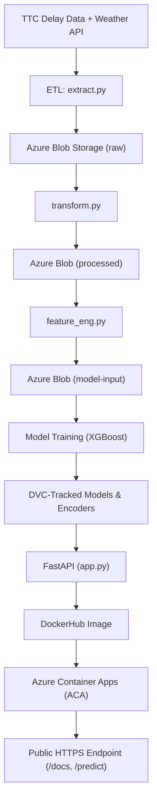

# TransitX — Transit Delay Prediction (Azure End-to-End, MLOps Project)
**TransitX** is a full end-to-end MLOps system that predicts TTC bus delay duration and delay likelihood using:
- Historical TTC delay data
- Weather archive & forecast data
- Route-level metadata
- Inference-time feature engineering

This project demonstrates modern data engineering, machine learning, cloud deployment, and CI/CD automation.

---

## Project Goal
Build a production-grade ML system that:
- Extracts & transforms multi-year transit + weather datasets
- Generates ML-ready engineered features
- Trains XGBoost models
- Supports batch & real-time streaming inference
- Serves predictions through FastAPI
- Is containerized with Docker
- Is deployed on Azure Container Apps
- Uses DVC for versioning, GitHub Actions for CI/CD

---

## Tech Stack
### Data Engineering
- Python
- Azure Blob Storage
- Apache Airflow

### ML / MLOps
- XGBoost, scikit-learn
- DVC (model & data versioning)
- MLflow (local experiment tracking)
- Inference-time feature engineering

### Deployment
- FastAPI
- Docker
- DockerHub
- Azure Container Apps (ACA)

### CI/CD
- GitHub Actions
- Automated Docker builds → DockerHub push


---

## Repository Structure
```bash
transitx-project/
├── airflow/                      
│   ├── dags/                    
│   └── docker-compose.yaml      
├── data/                         # gitignored
│   ├── raw/
│   ├── weather/
│   ├── model_input/
│   ├── predictions/
├── deployment/
│   ├── app.py                    # FastAPI streaming inference API
│   ├── Dockerfile
├── docs/                         # All project documentation
│   ├── architecture_overview.md
│   ├── etl_pipeline.md
│   ├── deployment_aca.md
│   └── cicd_pipeline.md
├── models/                       # Trained models (DVC-managed)
├── notebooks/
│   └── 01_EDA.ipynb
├── src/
│   ├── pipelines/
│   │   ├── extract.py
│   │   ├── transform.py
│   │   ├── feature_eng.py
│   │   └── load.py
│   ├── models/
│   │   ├── xgb_classifier.py
│   │   ├── xgb_regressor.py
│   │   └── predict.py            # Batch inference
│   └── utils/
│       ├── blob_client.py
│       ├── logger.py
│       ├── model_utils.py
│       └── firewall_helper.py
├── main.py                       # Manual ETL orchestration
├── requirements.txt              # Project dependencies
└── .github/workflows/
    └── ci-cd.yaml

---

## Architecture Overview
See full details:
- `docs/architecture_overview.md`

### High-Level Architecture

```mermaid
flowchart TB
    A["TTC Delay Data + Weather API"] --> B["ETL: extract.py"]
    B --> C["Azure Blob Storage (raw)"]
    C --> D["transform.py"]
    D --> E["Azure Blob (processed)"]
    E --> F["feature_eng.py"]
    F --> G["Azure Blob (model-input)"]
    G --> H["Model Training (XGBoost)"]
    H --> I["DVC-Tracked Models & Encoders"]
    I --> J["FastAPI (app.py)"]
    J --> K["DockerHub Image"]
    K --> L["Azure Container Apps (ACA)"]
    L --> M["Public HTTPS Endpoint (/docs, /predict)"]
```
### Pipeline:
***ETL → Feature Engineering → Model Training → Deployment***

> **End-to-End Workflow**  
>  
> Local FastAPI (`app.py`)  
> ↓  
> Local Streaming Inference Testing  
> ↓  
> Local Batch Inference (`predict.py`)  
> ↓  
> Docker Image Built & Tested Locally  
> ↓  
> DockerHub Push (`jaynid00/transitx-api`)  
> ↓  
> Azure Portal → Container App Deployment  
> ↓  
> **Public HTTPS Endpoint (`/docs`, `/predict`)**

---

## ETL Pipeline

Detailed documentation:
- `docs/etl_pipeline.md`

### ETL Stages
| Stage         | Script           | Output                     |
|---------------|------------------|-----------------------------|
| Extract       | `extract.py`     | Azure Blob → `raw`          |
| Transform     | `transform.py`   | Azure Blob → `processed`    |
| Feature Eng.  | `feature_eng.py` | Azure Blob → `model-input`  |
| Load          | `load.py`        | Azure SQL Table             |

Orchestration:
- Initially via `main.py`
- Fully automated via **Airflow DAG**

---

## Model Training

Models stored in `models/` (via DVC):
- `xgb_regressor.pkl`
- `xgb_classifier.pkl`
- `encoders.pkl`

Training scripts in `src/models/`
- `train_regressor.py`
- `train_classifier.py`

MLflow logs metrics locally in `mlruns/`.

---

## Inference Capabilities
### 1. Streaming / Real-Time Inference

Implemented in:
- `deployment/app.py`

Predicts:
- Delay minutes
- Delay classification
- Weather impact explanation
- Works for **past & future** timestamps

### 2. Batch Inference
Implemented in:
- `src/models/predict.py`
  - Input: `data/model_input/transit_features.csv`
  - Output: `data/predictions/transit_predictions.csv`
Uploads predictions → Azure Blob (`predictions` container)

---

## Dockerization

Dockerfile: `deployment/Dockerfile`

**Build image**
```bash
docker build -t transitx-api .
```
**Test locally**
```bash
docker run -p 8000:8000 transitx-api
```
**Push to DockerHub**
```bash
docker push jaynid00/transitx-api:latest
```

---

## Azure Deployment (ACA)

Detailed steps in:
- `docs/deployment_aca.md`

### Deployment Process
1. Verify API locally
2. Build & push Docker image
3. Create ACA environment (transitx-api)
4. Deploy container (transitx-api-app)
5. Inject Azure connection string
6. Access public endpoint

### Public Swagger docs
```php-template
https://<your-app>.<region>.azurecontainerapps.io/docs
```

---

## CI/CD (GitHub Actions → DockerHub)

Detailed steps:
- `docs/cicd_pipeline.md`

### Pipeline Automates:
- Python setup
- Dependency install
- DVC pull
- Lint & smoke test
- Docker build
- DockerHub push

File:
- `.github/workflows/ci-cd.yaml`

---

## Data Sources
### Transit Data (TTC Bus Delay)
[TTC Bus Delay Data](https://open.toronto.ca/dataset/ttc-bus-delay-data/)

### Weather Data (Historic + Forecast)
[Open-Meteo API](https://open-meteo.com/)

---

## Author
**Jaya Karthik Nidumolu**<br>
*MEng — Electrical & Computer Engineering (AI/ML), University of Waterloo*

Built to demonstrate real-world skills in:
- Data Engineering
- Cloud-MLOps
- API Deployment
- CI/CD Automation
- Azure Machine Learning Systems