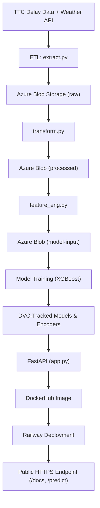

# TransitX — Transit Delay Prediction (Azure End-to-End, MLOps Project)
**TransitX** is a full end-to-end MLOps system that predicts TTC bus delay duration and delay likelihood using:
- Historical TTC delay data
- Weather archive & forecast data
- Route-level metadata
- Inference-time feature engineering

This project demonstrates modern **data engineering, machine learning, cloud deployment, and CI/CD automation.**

---

## Live Demo

### Interactive Streamlit Dashboard
[Live Streamlit Dashboard](https://transitx-project-jknidumolu.streamlit.app)

### Live Real-Time API (FastAPI via Railway)
`POST https://transitx-project-production.up.railway.app/predict`

---

## Project Highlights
- End-to-end ETL → Feature Engineering → Model Training → Deployment
- Real-time inference API (FastAPI + Docker + Railway)
- Interactive analytics dashboard (Streamlit)
- Airflow DAG for full orchestration
- DVC for dataset/model versioning
- CI/CD pipeline with GitHub Actions
- Cloud deployment originally on **Azure Container Apps**, now hosted on Railway
- Designed as a real-world MLOps showcase project

---

## Project Goal
Build a production-grade ML system that:
- Extracts & transforms multi-year transit + weather datasets
- Generates ML-ready engineered features
- Trains XGBoost models
- Supports batch & real-time streaming inference
- Serves predictions via containerized FastAPI
- Deploys on Cloud (Azure → Railway → GCP planned)
- Maintains reproducibility via DVC + CI/CD

---

## Tech Stack
### Data Engineering
- Python
- Azure Blob Storage
- Apache Airflow

### ML / MLOps
- XGBoost, scikit-learn
- DVC (model & data versioning)
- MLflow (local experiment tracking)
- Inference-time feature engineering

### Deployment
- FastAPI
- Docker
- DockerHub
- Azure Container Apps (Initially)
- Railway (now)

### Dashboard
- Streamlit
- Plotly

### CI/CD
- GitHub Actions
- Automated Docker builds → DockerHub push


---

## Repository Structure
```bash
transitx-project/
├── airflow/                      
│   ├── dags/                    
│   └── docker-compose.yaml      
├── data/                         # mostly gitignored
│   ├── raw/
│   ├── weather/
│   ├── model_input/
│   ├── predictions/
│   ├── processed/
├── dashboard/                    # Streamlit analytics dashboard
│   ├── app.py
│   ├── data/transit_processed.csv
│   ├── requirements.txt        # for dashboard
│   ├──.streamlit/
│   │   ├── 1_Transit_Analytics.py
│   │   └── 2_Live_Inference.py
│   └── pages/
│       ├── 1_Transit_Analytics.py
│       └── 2_Live_Inference.py
├── deployment/
│   ├── app.py                    # FastAPI streaming inference API
│   ├── Dockerfile
├── docs/                         # All project documentation
│   ├── architecture_overview.md
│   ├── etl_pipeline.md
│   ├── deployment_aca.md
│   └── cicd_pipeline.md
├── models/                       # Trained models (DVC-managed)
├── notebooks/
│   └── 01_EDA.ipynb
├── src/
│   ├── pipelines/
│   │   ├── extract.py
│   │   ├── transform.py
│   │   ├── feature_eng.py
│   │   └── load.py
│   ├── models/
│   │   ├── xgb_classifier.py
│   │   ├── xgb_regressor.py
│   │   └── predict.py            # Batch inference
│   └── utils/
│       ├── blob_client.py
│       ├── logger.py
│       ├── model_utils.py
│       └── firewall_helper.py
├── main.py                       # Manual ETL orchestration
├── requirements.txt              # Project dependencies
└── .github/workflows/
    └── ci-cd.yaml
```
---

## Architecture Overview
See full details:
- `docs/architecture_overview.md`

### High-Level Architecture

```mermaid
flowchart TB
    A["TTC Delay Data + Weather API"] --> B["ETL: extract.py"]
    B --> C["Azure Blob Storage (raw)"]
    C --> D["transform.py"]
    D --> E["Azure Blob (processed)"]
    E --> F["feature_eng.py"]
    F --> G["Azure Blob (model-input)"]
    G --> H["Model Training (XGBoost)"]
    H --> I["DVC-Tracked Models & Encoders"]
    I --> J["FastAPI (app.py)"]
    J --> K["DockerHub Image"]
    K --> L["Railway Deployment"]
    L --> M["Public HTTPS Endpoint (/docs, /predict)"]
```

---

### Pipeline  
***ETL → Feature Engineering → Model Training → Deployment***

> **End-to-End Workflow**  
>  
> Local FastAPI (`app.py`)  
> ↓  
> Local Streaming Inference Testing  
> ↓  
> Local Batch Inference (`predict.py`)  
> ↓  
> Docker Image Built & Tested Locally  
> ↓  
> DockerHub Push (`jaynid00/transitx-api`)  
> ↓  
> **(Previously) Azure Container Apps Deployment**  
> ↓  
> **(Current) Railway Deployment** — Builds and deploys automatically from GitHub  
> ↓  
> **Public HTTPS Endpoint (`/predict`)**

---

## ETL Pipeline

Detailed documentation:
- `docs/etl_pipeline.md`

### ETL Stages
| Stage         | Script           | Output                     |
|---------------|------------------|-----------------------------|
| Extract       | `extract.py`     | Azure Blob → `raw`          |
| Transform     | `transform.py`   | Azure Blob → `processed`    |
| Feature Eng.  | `feature_eng.py` | Azure Blob → `model-input`  |
| Load          | `load.py`        | Azure SQL Table             |

Orchestration:
- Initially via `main.py`
- Fully automated via **Airflow DAG**

---

## Model Training

Models stored in `models/` (via DVC):
- `xgb_regressor.pkl`
- `xgb_classifier.pkl`
- `encoders.pkl`

Training scripts in `src/models/`
- `train_regressor.py`
- `train_classifier.py`

MLflow logs metrics locally in `mlruns/`.

---

## Inference Capabilities

### 1. Streaming / Real-Time Inference
Implemented in:
- `deployment/app.py`

Provides:
- Predicted delay in minutes
- Delay classification
- Weather impact explanation
- Works for both **future** and **historical** timestamps

### 2. Batch Inference
Implemented in:
- `src/models/predict.py`

Input:
- `data/model_input/transit_features.csv`  

Output:
- `data/predictions/transit_predictions.csv`  
- Can automatically upload results to Azure Blob (optional)

---

## Streamlit Dashboard

### Live Dashboard

[Live Streamlit Dashboard](https://transitx-project-jknidumolu.streamlit.app)

**Pages Include:**

### 1. Transit Analytics (2023–2024)

Interactive filters for:
- Year
- Month range
- Top 30 routes
- Delay range
- Weekend toggle
- Rain / No Rain

**Visualizations:**
- Top 10 delayed routes
- Daily delay trend
- Temperature vs delay (rain intensity)

### 2. Live Prediction (Connected to FastAPI API)

User inputs:
- Date
- Time
- Route
- Location
- Incident type
- Gap between buses

Outputs:
- Predicted delay
- Classification
- Weather-impact explanation

---


## Dockerization

Dockerfile location: `deployment/Dockerfile`

**Build the image**
```bash
docker build -t transitx-api .
```
**Run locally**
```bash
docker run -p 8000:8000 transitx-api
```
**Push to DockerHub**
```bash
docker push jaynid00/transitx-api:latest
```

---

## Deployment History

Detailed Deployment Documentation:

- `docs/deployment_aca.md`

### Azure Container Apps (Original Deployment)

The system was first deployed to Azure Container Apps as part of the full MLOps workflow:
1. Build & push Docker image
2. Deploy container to ACA
3. Inject environment variables
4. Expose public HTTPS endpoint

Azure endpoint: *(no longer active due to subscription expiry)*
```bash
https://transitx-api-app.jollystone-d7b68f23.canadacentral.azurecontainerapps.io/docs
```

### Current Live Deployment — Railway

A lightweight public API deployment is now hosted on Railway:

**Live API Endpoint**
```arduino
https://transitx-project-production.up.railway.app/predict
```

Railway Deployment Features:
- Free-tier hosting
- Auto-build on every GitHub push
- Sleep/scale-to-zero (cost-efficient)
- Ideal for public demos and testing

### Future Deployment (Optional)
A production-ready deployment on Google Cloud Run is planned, leveraging:
- Always-free tier
- Fully serverless autoscaling
- Stable HTTPS endpoint.

This README will be updated once Cloud Run deployment is complete.

---

## CI/CD (GitHub Actions → DockerHub)

Detailed steps:
- `docs/cicd_pipeline.md`

### Pipeline Automates:
- Python setup
- Dependency install
- DVC pull
- Lint & smoke test
- Docker build
- DockerHub push

File:
- `.github/workflows/ci-cd.yaml`

---

## Data Sources
### Transit Data (TTC Bus Delay)
[TTC Bus Delay Data](https://open.toronto.ca/dataset/ttc-bus-delay-data/)

### Weather Data (Historic + Forecast)
[Open-Meteo API](https://open-meteo.com/)

---

## Author
**Jaya Karthik Nidumolu**<br>
*MEng — Electrical & Computer Engineering (AI/ML), University of Waterloo*

Built to demonstrate real-world skills in:
- Data Engineering
- Cloud-MLOps
- API Deployment
- CI/CD Automation
- Azure Machine Learning Systems