# TransitX — Architecture Overview

TransitX is a full end-to-end machine learning system deployed on Azure, with ETL pipelines, feature engineering, cloud storage, SQL loading, model training, CI/CD, and an API deployed on Azure Container Apps (ACA).

---

## High-Level System Diagram

```mermaid
flowchart LR
    A["TTC Delay Data + Weather API"] --> B["Extract: extract.py"]
    B --> C["Azure Blob Storage: raw"]

    C --> D["Transform: transform.py"]
    D --> E["Azure Blob Storage: processed"]

    E --> F["Feature Engineering: feature_eng.py"]
    F --> G["Azure Blob Storage: model-input"]

    G --> H["Model Training (XGBoost / sklearn)"]
    H --> I["MLflow Tracking (mlruns/)"]
    H --> J["Saved Models in models/"]

    E --> K["Azure SQL Loading (load.py)"]

    J --> L["FastAPI App (deployment/app.py)"]
    L --> M["DockerHub Image: jaynid00/transitx-api"]
    M --> N["Azure Container Apps (ACA): transitx-api-app"]
    N --> O["Public HTTPS Endpoint (/docs)"]
```

---

## Data Containers Overview
|Container|	Purpose|
|---------|--------|
|`raw`|	Raw TTC & weather files|
|`processed`|	Cleaned & merged dataset (post-transform)|
|`model-input`	| Feature-engineered ML-ready data|

---

## Azure SQL

`load.py` inserts processed data into Azure SQL for:
- dashboards
- analytics
- BI use cases

---

This architecture reflects clear separation of stages:

**ETL → Feature Engineering → Model Training → Deployment**

---
