# TransitX — Architecture Overview

TransitX is an end-to-end machine learning system deployed on **Google Cloud Platform (GCP)**. The system includes ETL pipelines, feature engineering, cloud storage, SQL loading, model training, continuous delivery, and a FastAPI service deployed using **Cloud Run**.

---

## High-Level System Diagram

```mermaid
flowchart LR
    A["TTC Delay Data + Weather API"] --> B["Extract: extract.py"]
    B --> C["Google Cloud Storage: raw"]

    C --> D["Transform: transform.py"]
    D --> E["Google Cloud Storage: processed"]

    E --> F["Feature Engineering: feature_eng.py"]
    F --> G["Google Cloud Storage: model-input"]

    G --> H["Model Training (XGBoost / sklearn)"]
    H --> I["MLflow Tracking (mlruns/)"]
    H --> J["Saved Models in models/ (DVC-managed)"]

    E --> K["BigQuery Loading (load.py)"]

    J --> L["FastAPI App (deployment/app.py)"]
    L --> M["Artifact Registry Image: transitx:latest"]
    M --> N["Cloud Run: transitx-api"]
    N --> O["Public HTTPS Endpoint (/docs)"]
```



---

## Google Cloud Storage (GCS) Buckets Overview
|GCS Bucket Folder|	Purpose|
|-----------------|--------|
|`raw`|	Raw TTC & weather files|
|`processed`|	Cleaned & merged dataset (post-transform)|
|`model-input`	| Feature-engineered, ML-ready data|

<br>
These folders are accessed through the GCP SDK or via DVC for version tracking.

---

## BigQuery

`load.py` inserts processed data into **BigQuery** for:
- BI dashboards
- analytics workloads
- SQL-based exploration
- downstream data consumers

BigQuery acts as the warehouse layer for the project.

---

## Model Training & Experiment Tracking
- Models (XGBoost, sklearn) are trained using the feature-engineered dataset.
- MLflow is used for local experiment logging.
- Final models and encoders are stored in the models/ directory and tracked using DVC.
- DVC remote storage is set to **Google Cloud Storage**.

---

## Deployment Architecture

### Containerization & Artifact Storage
- The FastAPI application (deployment/app.py) is packaged in a Docker container.
- The image is stored in Artifact Registry:
```ruby
us-central1-docker.pkg.dev/<project-id>/transitx/transitx:latest
```

### API Hosting

The API is hosted on **Cloud Run**, providing:
- serverless deployment
- auto-scaling
- HTTPS endpoint
- integration with DVC-restored model files

Cloud Run automatically receives updates through the CI/CD workflow.

---

## CI/CD (GitHub Actions → Artifact Registry → Cloud Run)
The CI/CD pipeline:
1. Runs validations and basic tests
2. Restores DVC artifacts from GCS
3. Builds a Docker image
4. Pushes it to Artifact Registry
5. Deploys the updated version to Cloud Run

This enables continuous delivery with every push to `main`.

---
## End-to-End Architecture Summary

**ETL → Feature Engineering → Model Training → SQL Loading → Deployment**

Each stage is modular:
- Reusable ETL scripts
- GCS for versioned data storage
- BigQuery for analytics
- MLflow for experiment tracking
- DVC for data/model versioning
- Cloud Run for API deployment

The pipeline forms a production-ready, cloud-native ML system on GCP.

---
