# TransitX — Architecture Overview

TransitX is a cloud-native machine learning system for predicting public transit delays.  
It includes an ETL pipeline, feature engineering, ML training, experiment tracking, CI/CD automation, and containerized API deployment on **Azure Container Apps (ACA)**.

---

## System Diagram (High Level)

```mermaid
flowchart LR
    A["TTC Delay Data + Weather API"] --> B["ETL: extract.py"]
    B --> C["Azure Blob Storage (raw)"]
    C --> D["ETL: transform.py + feature_eng.py"]
    D --> E["Azure Blob Storage (processed)"]
    E --> F["load.py"]
    F --> G["Model Training (XGBoost / sklearn)"]
    G --> H["MLflow Tracking (mlruns/)"]
    G --> I["Saved Models in models/"]
    I --> J["FastAPI App (deployment/app.py)"]
    J --> K["DockerHub Image: jaynid00/transitx-api"]
    K --> L["Azure Container Apps (ACA): transitx-api-app"]
    L --> M["Public HTTPS Endpoint (/docs)"]
```

---

## Components Breakdown

### 1. Data Layer
- Raw & processed data stored in Azure Blob Storage
- ETL scripts under src/pipelines/
### 2. Feature Engineering
- Implemented in feature_eng.py
- Handles time-based and weather-based features
### 3. ML Training
- Classifier & regressor in models/
- Tracked using MLflow (mlruns/)
### 4. Serving Layer
- FastAPI inference app in deployment/app.py
- Dockerized and pushed to DockerHub
### 5. Deployment
- Final container deployed via Azure Container Apps
- Provides autoscaling, HTTPS, logs, revision management

This architecture reflects real-world MLOps patterns — modular, scalable, cloud-native.
